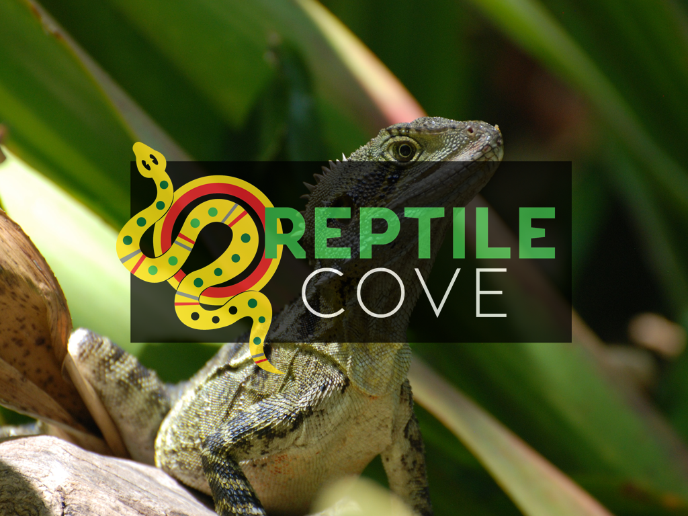
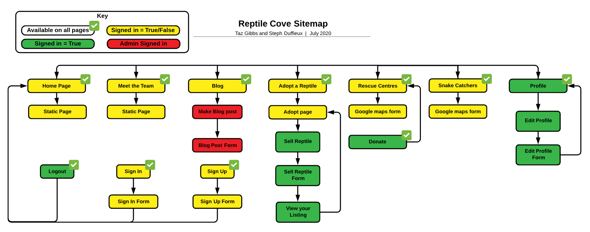
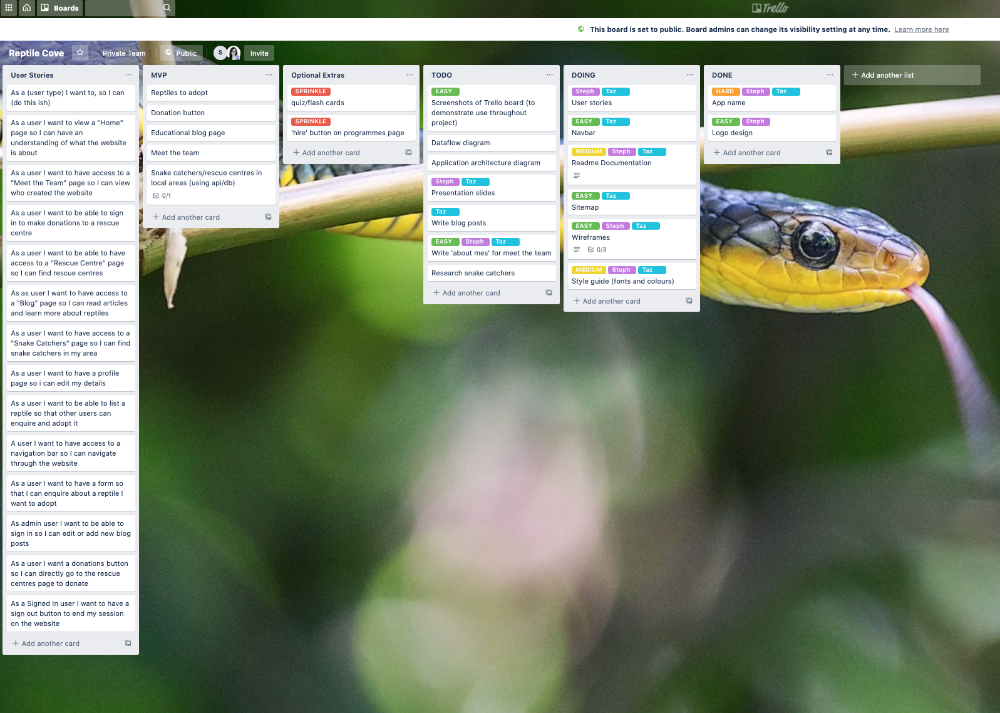
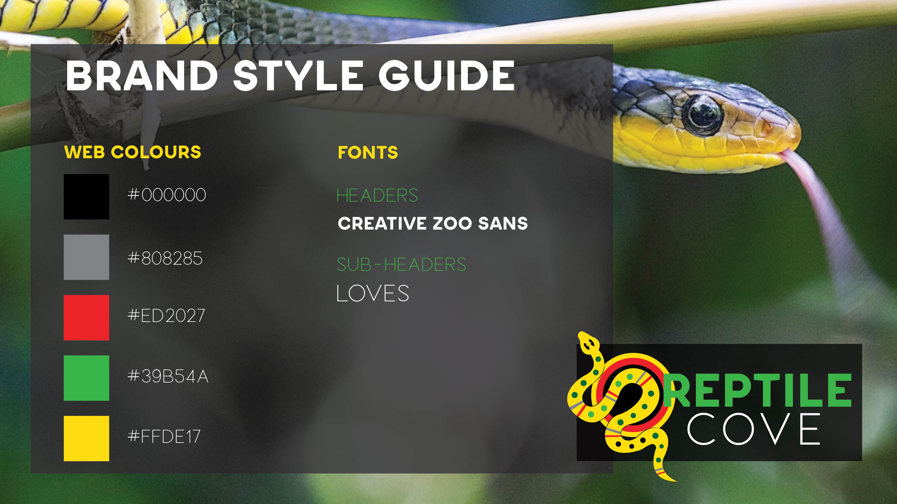
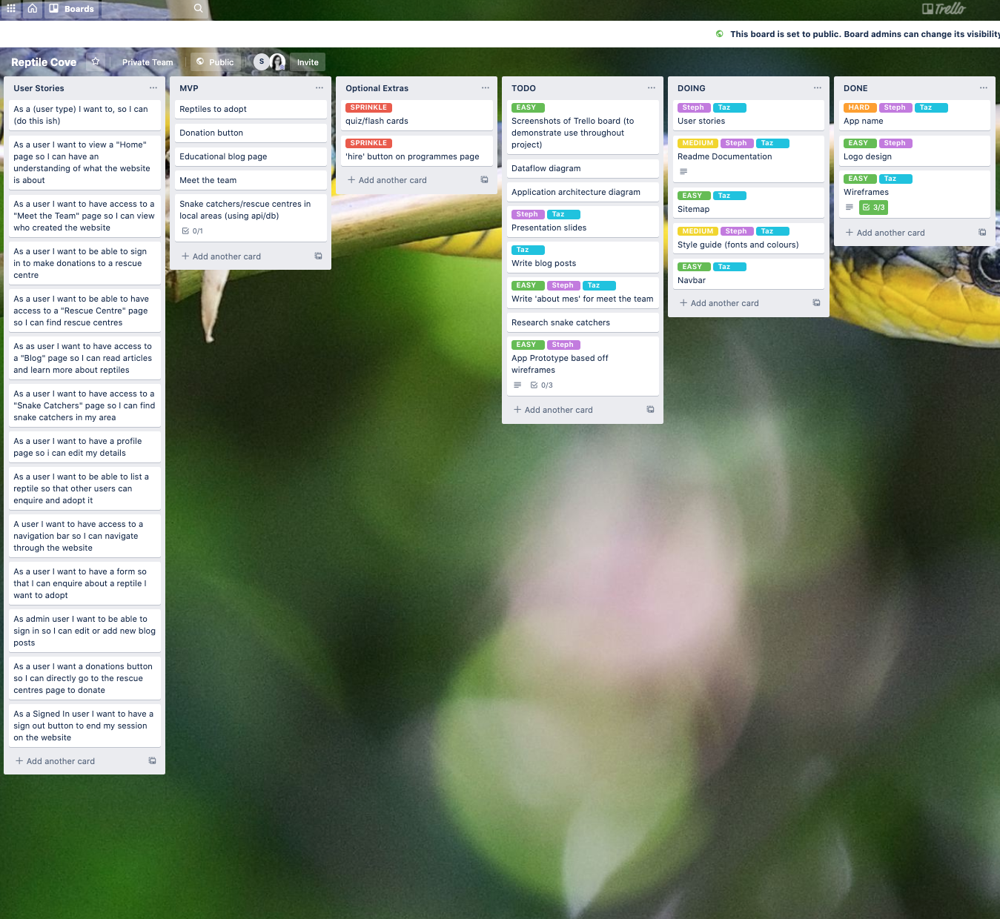

# Reptile Cove
T3A2-A Full Stack Application (Part A) | By Taz Gibbs & Stephanie Duffieux | July 2020

* [Reptile Cove]() - Live Website
* [GitHub Repository](https://github.com/HeyitsmeTazG/ReptileCove)

**Right click the image below and open in a new tab to view our trailer video**

## R1 Description of the Website

### Purpose

The purpose for our site is to create a platform that educates Australians on native reptile species, why they are vital to our ecosystems, and how we can better protect them.

Conservation is something all Australians are responsible for, however, there is a lack of easily accessible information available. Most information regarding Australia’s native reptile species are scientific journals, and other academic works. We want to change that.

The native population for snakes and other reptiles has been on a downhill slope for decades now. People either take the animals out of the wild, or they kill them out of fear. These decisions can have lasting impacts on natural ecosystems, and as the reptile population decimates, the ‘prey’ population increases. This imbalance has a domino effect on pest control, global warming, and several other issues (such as water availability and crop farming).

Our plan for this interactive site includes many features we feel are important for educating Australians, and how we can all do our part to protect our native reptile species.

### Functionality/Features

##### "Home" Page
Welcomes the user to the website, includes a short video and purpose of the website. 

##### "Meet Us" Page
Introduces the user to the team behind Reptile Cove. The user can fill out a contact form if they wish to get in touch with the team.  

##### "Adopt a Reptile" Page
Users that are not signed in can view a list of reptiles available to adopt. A user must be signed in to enquire and adopt a reptile. Users can also add a reptile for adoption, with relevant information, including age, medical history, temperament, and husbandry requirements.  

##### "Blog" Page
Users can view educational posts written by Reptile Cove's admin team. An admin user can log in and update blog posts or add new blog posts.

##### "Snake Catchers" Page

Users can find snake catchers in their local region by entering their postcode which will give them a list of their nearest catchers. This section is linked to google maps.

##### "Rescues" Page

Shows a list of rescue centres. Each rescue centre has a "Make a Donation" feature button allowing a user to make donations. This section is also linked to google maps, so a user can find other rescue centres near them.

##### Profile Page

When a user is logged in they can view their profile page which includes a history of their donations, a list of their reptile listings, and user/profile settings to update their details.

##### Sign Up/In Page

This page holds 2 forms, and renders either the Sign Up, or Sign In page depending on whether or not a user is signed in. There is a button to change the view from Sign Up to Sign In.

##### Footer

Includes a "Donate" button which directs the user to the "Rescues" page and a Sign In/Sign Out button.

### Target Audience

##### Demographic

* Primary school to high school students

Reptile Cove seeks to attract an audience of primary to high school students and aims to educate and raise awareness through educational blog posts on the role they can play from a young age in protecting Australia's native reptile species.

* Young to middle age adults 

Reptile Cove seeks to attract an audience of young to middle age adults who are passionate about reptiles  and want to contribute to protecting them through donations and adoptions. Reptile Cove also aims to educate its adult demographic on the importance and crucial role they can play in saving Australia's native reptile species.  

* Elder generations

Reptile Cove seeks to attract an audience of all ages to educate Australians on how to respect and care for Australia's native reptile species. The Snake Catchers page is aimed to help Australians have unwanted reptile guests safely relocated. The blog posts are aimed to help educate all Australians, regardless of age, on why our native reptile species are cruicial to natural ecosystems and why they should be protected.

### Tech Stack

* MERN Stack (MongoDB, Express, React, Node)
* GitHub
* Visual Studio Code
* HTML5
* CSS3
* Bootstrap (frontend styling)
* Heroku (deployment platform)
* Cloudinary (Cloud storage)
* Stripe (third party payment system)
* Google Maps (third party map system)
* Adobe Illustrator (Logo vector art)
* Adobe Photoshop (image resizing)
* Figma (draft wireframes)
* Adobe XD (wireframe mockups)
* Unsplash (free stock images)
* Trello.com (project management, user stories)
* Keynote (Slide deck presentation)

## R2 Dataflow Diagram

TBC **TAZ TO DO MONDAY** -- started

## R3 Application Architecture Diagram

## Sitemap

## User Stories 

<strong>Standard User</strong>

<ul>
<li>A user I want to have access to a navigation bar so I can navigate through the website</li>
<li>As a User I want to view a "Home" Page so I can have an understanding of the purpose of the website</li>
<li>As a user I want to have access to a "Meet the Team" page so I can view who created the website</li>
<li>As a user I want to have a contact form so that I can email the website creators with any feedback or enquiries about the site</li>
<li>As a user I want to have access to a "Blog" page so I can learn about reptiles and how to protect them</li>
<li>As a user I want to have access to an "Adopt" page so I can view any reptiles available for adoption</li>
<li>As a user I want to have a form so that I can enquire about a reptile I want to adopt</li>
<li>As a user I want to be able to sign up/in so I can list a reptile for adoption</li>
<li>As a user I want to have access to a "Rescue Centres" page so I can search for rescue centres in my local area</li>
<li>As a user I want to be able to sign up/in to make donations to a rescue centre</li>
<li>As a user I want to have access to a "Snake Catchers" page so I can find snake catchers in my local area</li>
</ul>

<strong>Admin</strong>

<ul>
<li>As an admin I want to be able to sign up/in so I can create blog posts</li>
<li>As an admin I want to be able to edit blog posts so I can update any changes I need to make (e.g spelling errors/photos)</li>
<li>As an admin I want to be able to delete a blog post so it doesnt appear on the site</li>
<li>As an admin I want to have full access of the site so I can remove any inapppropriate posts, and moderate user interaction</li>
<li>As an admin I want to be able to delete adoption listings made by other users if the listing does not meet the requirements, or has been adopted out or has passed</li>
</ul>

<strong>Signed In User</strong>

<ul>
<li>As a signed-in user I want to be able to list a reptile so that other users can enquire and adopt it</li>
<li>As a signed-in user I want to be able to delete one of my own adoption posts if the reptile I have listed has been adopted or has passed</li>
<li>As a signed-in user I want to be able to make a donation to one or more of the rescue centres</li>
<li>As a signed-in user I want to have a profile page so i can edit my profile and security deatils</li>
<li>As a signed-in user I want a sign out button so I can end my session on the website</li>
</ul>

 

## Wireframes

### Figma Link to all Wireframes

[Figma Link]()

### Desktop

### Tablet

### Mobile

## Style Guide

## Prototype

**Click the image below to view our application prototype**

## Screenshots of Trello Board

[View Live Trello Board](https://trello.com/b/cBMk0jEf/reptile-cove)

#### Initial Stage - 11/07/2020

#### Progress - 12/07/2020

